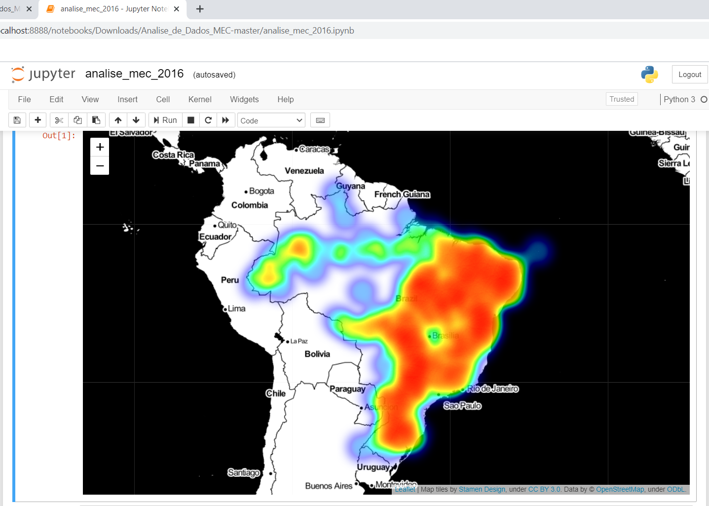

# Análise de Dados do MEC

## PROUNI
Programa que concede bolsas de estudo integrais e parciais de 50% em instituições privadas de educação superior, em cursos de graduação e sequenciais de formação específica, a estudantes brasileiros sem diploma de nível superior.

## O que foi disponibilizado?
Dados referentes ao detalhamento quantitativo das bolsas concedidas por ano, segmentadas por região, unidade federativa e município, instituição de educação superior, nome do curso, modalidade de ensino (presencial ou a distância – EAD), turno e tipo de bolsa. Podendo ser acessado em: [Prouni - Dados Abertos](http://dadosabertos.mec.gov.br/prouni).

## Dicionário de Dados
Conheça o [dicionário de dados referente às bolsas concedidas e ao perfil dos beneficiários do Prouni](http://dadosabertos.mec.gov.br/images/pdf/dicionario-prouni-20161222.pdf).

## Tópicos da análise
- Quais são os 5 cursos que obtiveram maior concessão de bolsas em universidades particulares do Brasil no ano de 2016.
- Mapa de calor que mostra a concentração de cidades que mais obtiveram aprovação de bolsas, também no ano de 2016.

## Imagem do mapa após a execução do script

