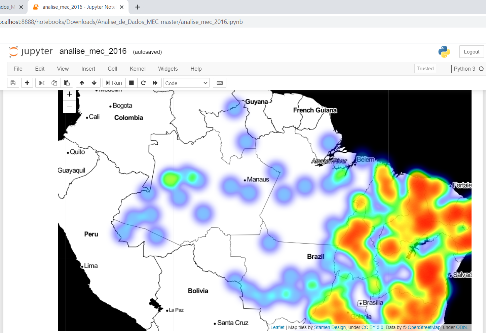
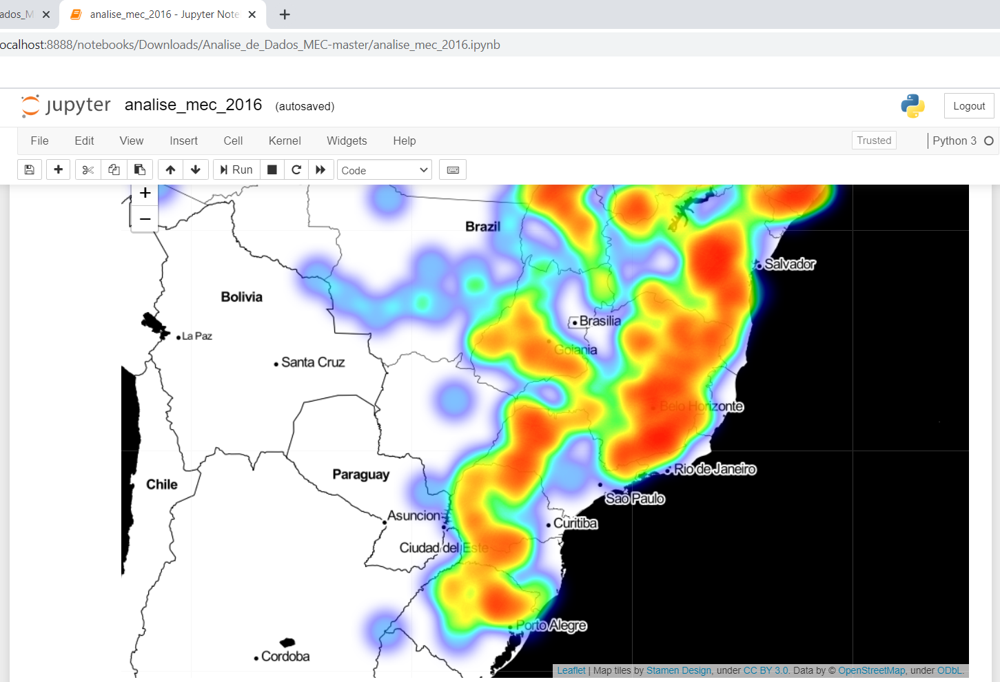
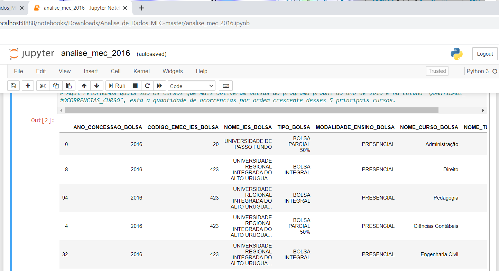

# Análise de Dados do MEC

## PROUNI
Programa que concede bolsas de estudo integrais e parciais de 50% em instituições privadas de educação superior, em cursos de graduação e sequenciais de formação específica, a estudantes brasileiros sem diploma de nível superior.

## O que foi disponibilizado?
Dados referentes ao detalhamento quantitativo das bolsas concedidas por ano, segmentadas por região, unidade federativa e município, instituição de educação superior, nome do curso, modalidade de ensino (presencial ou a distância – EAD), turno e tipo de bolsa. Podendo ser acessado em: [Prouni - Dados Abertos](http://dadosabertos.mec.gov.br/prouni).

## Dicionário de Dados
Conheça o [dicionário de dados referente às bolsas concedidas e ao perfil dos beneficiários do Prouni](http://dadosabertos.mec.gov.br/images/pdf/dicionario-prouni-20161222.pdf).

## Tópicos da análise
- Mapa de calor que mostra a concentração de municípios que mais obtiveram aprovação de bolsas em universidades no ano de 2016.
- Os 5 cursos com maior ocorrência de aprovação de bolsas.

## O resultado após a execução do script
O mapa a seguir mostra quais foram as cidades que obtiveram bolsas no programa Prouni, através de sua localização, e as áreas com maior concentração. Aa áreas com maior concentração são representadas de forma mais "quente" e as com menor, "fria". Lembrando que esses não são os dados totais, e sim uma pequena amostra (500 linhas de valores).
Para coloração do mapa foi utilizado um arquivo com extensão .csv - disponibilizado em http://www.dados.gov.br/ - onde contém todos os municípios brasileiros, sua latitude e longitude.

Aqui mostra quais são os cursos que mais obtiveram aprovação de bolsas no programa Prouni (limitado aos 5 primeiros).

